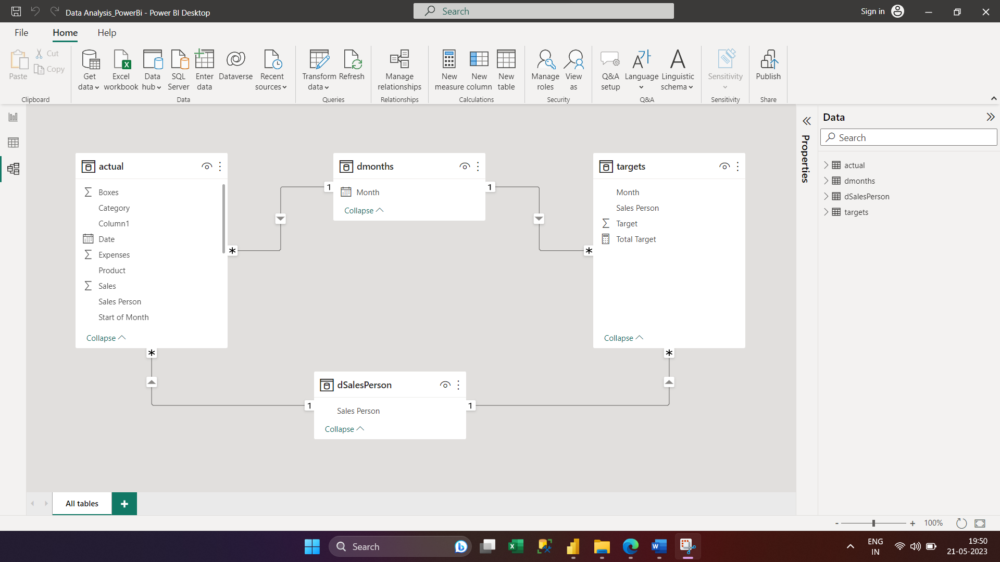
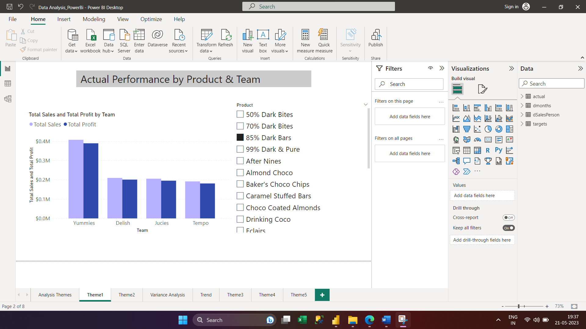

# DATA ANALYSIS ON SALES OF CHOCOLATE COMPANY:
Demonstrate data analysis skills by successfully analyzing large-scale datasets. Utilized advanced Power BI techniques to identify and resolve complex problems.
## Project Overview:
### Objectives:
###### •	Data Modeling

###### •	Actual Performance by Product and Team

###### •	Variance Analysis by Person (Overall)
###### •	Who has the most variance in each month?
###### •	Which products have the highest profit per box?
###### •	Total Sales vs. Total Target Graph
